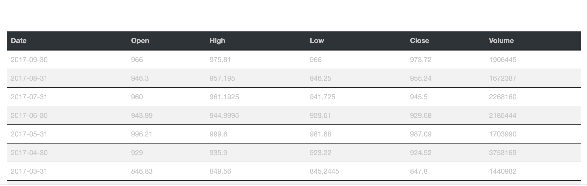

# Stock-Time-Series-Dashboard

In this activity, you will incorporate your financial time series project into an HTML-based dashboard.

## Instructions

* Modify the starter code to create your own dashboard.

* Customize the dashboard to show the name of company, date range, and information about the company.

* Feel free to customize the chart in other ways by using [Plotly's API](https://plot.ly/javascript/configuration-options/#making-a-responsive-chart).

* There is code that populates the dashboard with a table of values. Feel free to study and modify the code, or replace the section.

## output screen

